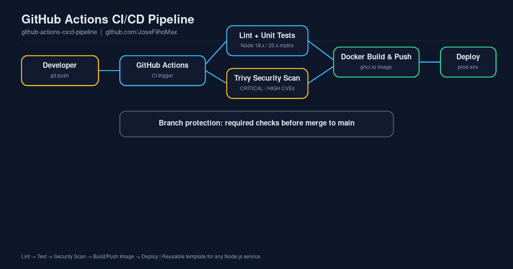

# GitHub Actions CI/CD Pipeline Template

[](https://github.com/JoseFilhoMax/github-actions-cicd-pipeline/actions/workflows/ci.yml)
[](LICENSE)

A production-style, reusable CI/CD pipeline built with **GitHub Actions**. It lints, tests, security-scans, builds a Docker image, publishes it to **GitHub Container Registry**, and includes a deploy stage you can point at any target (Kubernetes, ECS, a VM over SSH, etc.).

It ships with a minimal Express.js API (`app/`) so the pipeline runs end-to-end out of the box — fork it, swap the app, keep the pipeline.



## Why this exists

Most CI/CD examples online only show "npm test in a YAML file." This template covers what actually matters in production: a test matrix across Node versions, dependency/image vulnerability scanning with Trivy, branch-protected merges, immutable image tags via `docker/metadata-action`, and build layer caching so the pipeline stays fast as the repo grows.

## Pipeline stages

1. **Lint & Test** — runs on Node 18.x and 20.x in parallel.
2. **Security Scan** — Trivy scans the filesystem for CRITICAL/HIGH CVEs.
3. **Build & Push** — builds the Docker image and pushes it to `ghcr.io`, tagged by branch, SHA, and semver when applicable.
4. **Deploy** — placeholder stage gated behind a GitHub Environment (`production`), ready to be wired to your infra.

## Quick start

```bash
git clone https://github.com/JoseFilhoMax/github-actions-cicd-pipeline.git
cd github-actions-cicd-pipeline/app
npm install
npm test
npm start        # http://localhost:3000/health
```

Push to a fork and the workflow in `.github/workflows/ci.yml` runs automatically.

## Project structure

```
.github/workflows/ci.yml   # the pipeline itself
app/                        # demo Express API (replace with your own)
  src/                      # app code
  tests/                    # node:test unit tests
  Dockerfile
docs/architecture.png       # diagram above
```

## Adapting it to your project

- Swap `app/` for your own service; keep the same npm scripts (`test`, `lint`) and the workflow keeps working.
- Point the `deploy` job at your target with a few lines (kubectl, aws ecs update-service, ansible-playbook, etc.).
- Add branch protection rules on `main` requiring the `lint-and-test` and `security-scan` checks.

## License

MIT — see [LICENSE](LICENSE). Contributions welcome, see [CONTRIBUTING.md](CONTRIBUTING.md).
